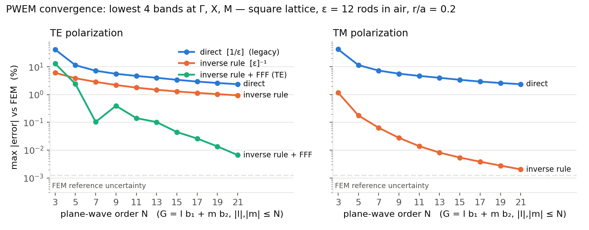
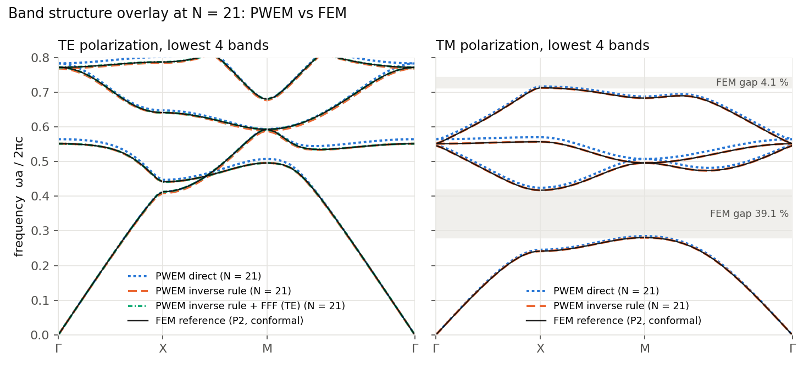

# Photonic Bandgap Suite

An interactive computational suite for calculating and visualizing the band structure, transmission spectra and dispersion relations of 1D and 2D photonic crystals.

Built with **Python**, **NumPy/SciPy**, **Matplotlib** and **Streamlit**; the 2D engine is a plane-wave expansion (PWEM) solver that is benchmarked against an independent finite-element reference (see [Benchmark](#benchmark-pwem-vs-conformal-fem)).

**Live application:** https://photonicbandgapsuite-cbo4zhgm2tlhbbpugujkqn.streamlit.app/

---

## Features

* **1D multilayer stacks:** analytical Bloch band structure and transfer-matrix transmittance for a finite number of periods.
* **2D square and triangular lattices** of circular rods/holes: in-plane (k<sub>z</sub> = 0) band structures along Γ–X–M–Γ and Γ–M–K–Γ, TE (H<sub>z</sub>) and TM (E<sub>z</sub>) solved separately.
* **Plane-wave order up to N = 21** (≈ 1600 plane waves) and a choice of Fourier factorization (inverse rule, inverse rule + fast Fourier factorization, or the legacy direct transform).
* **Interactive parameter sweeps** of lattice constant, dielectric contrast, rod radius and resolution.

---

## Physics core

### 1. Transfer-matrix method for 1D crystals

Each layer is represented by a characteristic matrix *M*; for *N* layers the system matrix is the product *M*<sub>1</sub>*M*<sub>2</sub>…*M*<sub>N</sub>, from which the transmittance follows. The infinite-crystal band structure follows from the Bloch condition

$$\cos(K\Lambda) = \cos(k_1 b)\cos(k_2 a) - \tfrac12\left(\tfrac{k_1}{k_2} + \tfrac{k_2}{k_1}\right)\sin(k_1 b)\sin(k_2 a)$$

with Λ the pitch and *k*<sub>1</sub>, *k*<sub>2</sub> the wave numbers in the two media.

### 2. Plane-wave expansion for 2D crystals (`pbs/pwem2d.py`)

The Bloch field is expanded in plane waves, *u*(**r**) = Σ<sub>**G**</sub> *c*(**G**) e<sup>i(**k**+**G**)·**r**</sup>, over the reciprocal-lattice vectors **G** = *l* **b**<sub>1</sub> + *m* **b**<sub>2</sub> with |*l*|, |*m*| ≤ N inside a circular cut-off. The two polarizations become the matrix eigenproblems

$$\text{TM } (E_z):\quad \sum_{\mathbf G'} |\mathbf k+\mathbf G|\,\mathcal F(\mathbf G,\mathbf G')\,|\mathbf k+\mathbf G'|\;c(\mathbf G') = \frac{\omega^2}{c^2}\,c(\mathbf G)$$

$$\text{TE } (H_z):\quad \sum_{\mathbf G'} (\mathbf k+\mathbf G)\cdot\mathcal F(\mathbf G,\mathbf G')\,(\mathbf k+\mathbf G')\;c(\mathbf G') = \frac{\omega^2}{c^2}\,c(\mathbf G)$$

where 𝓕 is the matrix that represents multiplication by 1/ε(**r**) in the truncated plane-wave basis. **How 𝓕 is built decides the convergence rate** (see the benchmark below). Three choices are implemented, selectable with `method=`:

| `method` | 𝓕 | reference |
|---|---|---|
| `"direct"` (legacy) | Toeplitz matrix of the Fourier coefficients of 1/ε: 𝓕<sub>ij</sub> = (1/ε)^(**G**<sub>i</sub> − **G**<sub>j</sub>) — Laurent's rule | Plihal & Maradudin, PRB 44, 8565 (1991) |
| `"inverse"` (default) | inverse of the Toeplitz matrix of ε: 𝓕 = [ε]<sup>−1</sup>, [ε]<sub>ij</sub> = ε̂(**G**<sub>i</sub> − **G**<sub>j</sub>) — the inverse rule | Ho, Chan & Soukoulis, PRL 65, 3152 (1990); Li, JOSA A 13, 1870 (1996) |
| `"fff"` | TM as `"inverse"`; TE uses 𝓕<sub>αβ</sub> = [1/ε] δ<sub>αβ</sub> − ([1/ε] − [ε]<sup>−1</sup>) [N<sub>α</sub>N<sub>β</sub>] with **N** the rod-boundary normal — fast Fourier factorization (square lattice) | Popov & Nevière, JOSA A 18, 2886 (2001); David, Benisty & Weisbuch, JOSA A 23, 1141 (2006) |

For a circular rod of radius *R* in a cell of area *A*<sub>u</sub> the Fourier coefficients are analytic: ε̂(0) = ε<sub>rod</sub> *f* + ε<sub>bg</sub>(1 − *f*) and ε̂(**G**) = (ε<sub>rod</sub> − ε<sub>bg</sub>) *f* · 2 J<sub>1</sub>(|**G**|R)/(|**G**|R), with *f* = πR²/*A*<sub>u</sub>.

```python
from pbs.pwem2d import pwem_bands
r = pwem_bands("square", eps_rod=12.0, eps_bg=1.0, r_a=0.2, N=11)   # method="inverse"
r["TE"], r["TM"]           # (Nk, nbands) arrays of omega a / 2 pi c along Gamma-X-M-Gamma
```

---

## Benchmark: PWEM vs conformal FEM

**Case.** Square lattice of dielectric rods, ε<sub>rod</sub> = 12, ε<sub>bg</sub> = 1 (12:1 contrast), *r*/*a* = 0.2, k-path Γ–X–M–Γ with 20 points per leg. **Reference.** An independent Bloch-periodic finite-element solver (`benchmarks/fem_reference.py`, [scikit-fem](https://github.com/kinnala/scikit-fem)) on a conformal triangular mesh whose edges follow the rod boundary, quadratic Lagrange elements, periodicity imposed by identifying the DOFs on opposite cell edges; the reference is converged to ~10<sup>−5</sup> (mesh-halving check in the last line of the tables). Everything below is regenerated by

```
python benchmarks/fem_reference.py        # FEM reference        -> results/fem_reference.json   (~10 min)
python benchmarks/pwem_convergence.py     # PWEM sweep, N = 3..21 -> results/pwem_convergence.json (~5 min)
python benchmarks/make_report.py --readme # figures + tables      -> figures/, results/benchmark_section.md, README
```

(`pip install -r benchmarks/requirements-bench.txt` adds scikit-fem and the Triangle mesher.)

### Results



*Maximum relative error of the lowest four bands at Γ, X and M against the FEM reference, versus plane-wave order N, for the three factorizations. TM: the inverse rule alone reaches the reference floor. TE: the inverse rule halves the error but keeps the 1/N slope; the fast Fourier factorization restores fast convergence.*



*Lowest four bands along Γ–X–M–Γ at N = 21 (1605 plane waves) overlaid on the FEM reference; shaded bands are the FEM gaps.*

<!-- benchmark:begin -->
**Table 1 - lowest four bands at Γ, X, M (ωa/2πc), PWEM at N = 21 (1605 plane waves) vs FEM. Signed error in % in parentheses.**

| pol. | k | band | FEM | direct [1/ε] | inverse rule [ε]⁻¹ | inverse + FFF |
|---|---|---|---|---|---|---|
| TM | Γ | 2 | 0.5460 | 0.5460 (+0.007) | 0.5460 (-0.000) | 0.5460 (-0.000) |
| TM | Γ | 3 | 0.5513 | 0.5643 (+2.365) | 0.5513 (+0.002) | 0.5513 (+0.002) |
| TM | Γ | 4 | 0.5513 | 0.5643 (+2.365) | 0.5513 (+0.002) | 0.5513 (+0.002) |
| TM | X | 1 | 0.2416 | 0.2457 (+1.684) | 0.2416 (+0.000) | 0.2416 (+0.000) |
| TM | X | 2 | 0.4172 | 0.4242 (+1.692) | 0.4172 (+0.001) | 0.4172 (+0.001) |
| TM | X | 3 | 0.5568 | 0.5699 (+2.367) | 0.5568 (+0.002) | 0.5568 (+0.002) |
| TM | X | 4 | 0.7124 | 0.7164 (+0.560) | 0.7124 (+0.001) | 0.7124 (+0.001) |
| TM | M | 1 | 0.2807 | 0.2851 (+1.571) | 0.2807 (+0.000) | 0.2807 (+0.000) |
| TM | M | 2 | 0.4959 | 0.5073 (+2.297) | 0.4959 (+0.002) | 0.4959 (+0.002) |
| TM | M | 3 | 0.4959 | 0.5073 (+2.314) | 0.4959 (+0.002) | 0.4959 (+0.002) |
| TM | M | 4 | 0.6827 | 0.6872 (+0.664) | 0.6827 (+0.001) | 0.6827 (+0.001) |
| TE | Γ | 2 | 0.5513 | 0.5643 (+2.366) | 0.5513 (+0.002) | 0.5513 (+0.007) |
| TE | Γ | 3 | 0.7713 | 0.7828 (+1.488) | 0.7685 (-0.368) | 0.7714 (+0.002) |
| TE | Γ | 4 | 0.7713 | 0.7828 (+1.488) | 0.7685 (-0.368) | 0.7714 (+0.002) |
| TE | X | 1 | 0.4127 | 0.4127 (+0.001) | 0.4088 (-0.941) | 0.4127 (-0.001) |
| TE | X | 2 | 0.4413 | 0.4470 (+1.307) | 0.4410 (-0.055) | 0.4413 (+0.002) |
| TE | X | 3 | 0.6408 | 0.6472 (+1.005) | 0.6402 (-0.094) | 0.6408 (+0.002) |
| TE | X | 4 | 0.7868 | 0.8011 (+1.818) | 0.7844 (-0.301) | 0.7868 (+0.003) |
| TE | M | 1 | 0.4959 | 0.5073 (+2.304) | 0.4959 (+0.001) | 0.4959 (+0.003) |
| TE | M | 2 | 0.5927 | 0.5934 (+0.114) | 0.5884 (-0.716) | 0.5927 (+0.000) |
| TE | M | 3 | 0.5927 | 0.5934 (+0.114) | 0.5885 (-0.709) | 0.5927 (+0.000) |
| TE | M | 4 | 0.6792 | 0.6793 (+0.001) | 0.6762 (-0.455) | 0.6792 (-0.001) |

**Table 2 - max |error| over the same 4 bands x 3 k-points, in %, vs plane-wave order N.**

| N | plane waves | direct TE | direct TM | inverse TE | inverse TM | FFF TE |
|---|---|---|---|---|---|---|
| 3 | 37 | 42.001 | 42.725 | 6.095 | 1.1830 | 13.0730 |
| 5 | 97 | 11.459 | 11.533 | 3.889 | 0.1779 | 2.4286 |
| 7 | 185 | 7.226 | 7.329 | 2.872 | 0.0640 | 0.1039 |
| 9 | 305 | 5.613 | 5.660 | 2.216 | 0.0277 | 0.3945 |
| 11 | 453 | 4.706 | 4.714 | 1.785 | 0.0139 | 0.1426 |
| 13 | 621 | 4.029 | 4.027 | 1.496 | 0.0081 | 0.1025 |
| 15 | 825 | 3.410 | 3.410 | 1.297 | 0.0054 | 0.0449 |
| 17 | 1057 | 2.947 | 2.947 | 1.154 | 0.0038 | 0.0262 |
| 19 | 1317 | 2.617 | 2.616 | 1.040 | 0.0028 | 0.0136 |
| 21 | 1605 | 2.366 | 2.367 | 0.941 | 0.0020 | 0.0066 |

**Table 3 - gaps between consecutive bands over the full Γ-X-M-Γ path (lower edge - upper edge, gap/midgap %). PWEM at N = 21.**

| pol. | bands | FEM | direct [1/ε] | inverse rule [ε]⁻¹ | inverse + FFF |
|---|---|---|---|---|---|
| TM | 1-2 | 0.2807 - 0.4172 (39.12 %) | 0.2851 - 0.4242 (39.24 %) | 0.2807 - 0.4172 (39.12 %) | 0.2807 - 0.4172 (39.12 %) |
| TM | 4-5 | 0.7124 - 0.7420 (4.08 %) | 0.7164 - 0.7489 (4.44 %) | 0.7124 - 0.7420 (4.08 %) | 0.7124 - 0.7420 (4.08 %) |
| TM | 6-7 | — | 0.8783 - 0.8811 (0.32 %) | — | — |
| TE | 4-5 | — | 0.8208 - 0.8223 (0.19 %) | — | — |

FEM reference: scikit-fem, P2 (ElementTriP2), conformal triangle mesh, 14530 elements / 29060 DOFs (h = 0.015); halving h from 0.03 to 0.015 changes the tabulated bands by at most 0.0012 %, which is the resolution floor of every error quoted above.

<!-- benchmark:end -->

### Why the direct transform converges from above, and slowly

Every truncated Fourier product of two periodic functions is a Laurent (Cauchy) product. Li (1996) showed that this rule converges well only when at most one factor is discontinuous at any point. In Maxwell's equations at a dielectric boundary the two factors jump *together and in opposite directions*: for TM, 1/ε jumps down where ∇²E<sub>z</sub> = −ε (ω/c)² E<sub>z</sub> jumps up, and their product is continuous. The truncated Fourier series of each factor overshoots at the boundary (Gibbs phenomenon), the overshoots do not cancel in the Laurent product, and the discretization error decays only like 1/N — the "direct" curves above improve by only a factor ≈ 2.4 while the basis grows from 305 to 1605 plane waves. The sign is systematic: the truncated series smears the small low-1/ε region (the rod) into the background, so a mode whose field is concentrated in the rods sees an effective permittivity below 12 and comes out too stiff — 19 of the 22 tabulated bands land **0.5–2.4 % too high at N = 21** (Table 1; the three exceptions are modes that hardly sample the boundary jump and are exact to 0.01 %), the figure the suite was first flagged for. The error is also band-dependent, so where two bands nearly touch the unequal shifts open a false gap: the narrow **spurious TM gap between bands 6 and 7 (0.3 %)** and a spurious TE gap between bands 4 and 5 in the direct results (Table 3) — neither exists in the FEM reference.

The inverse rule replaces the truncated series of 1/ε with the inverse of the truncated matrix of ε. For a product with concurrent complementary jumps this is the factorization whose truncation error is uniform across the boundary, so the Gibbs overshoots cancel. For TM it is the whole story: E<sub>z</sub> is a scalar, the eigenproblem with [ε] is exactly the Rayleigh–Ritz projection of the ε-weighted problem (the symmetric [ε]<sup>−1</sup> form has the same spectrum), so the eigenvalues converge from above, and the error drops from 2.4 % to **0.002 %** at N = 21; both spurious gaps disappear and the real TM gaps (39.1 % and 4.1 %) agree with FEM to four digits.

For TE the derivative ∇H<sub>z</sub> ∝ ẑ × **D** has a component normal to the boundary and one tangential to it, and Li's rules assign the inverse rule to only one of them. Applying [ε]<sup>−1</sup> to both is still asymptotically correct but reintroduces a 1/N error with the opposite sign, so the "inverse" TE bands converge **from below**, to 0.9 % at N = 21 (worst at X, band 1 — a mode for which the plain direct transform happens to be exact to 0.001 %, cf. Table 1, consistent with a field derivative that is almost tangential at the rod boundary, the one component for which Laurent's rule is the right one). Splitting the operator with the normal-vector field of the rod boundary (`method="fff"`) uses the right rule for each component and brings TE to **0.007 %** at N = 21, at the cost of a non-Hermitian matrix (a general `eig` instead of `eigh`, ≈ 5–7× slower).

### Residual limits of PWEM against a conformal FEM mesh

* **Sharp defects and corners.** The factorization rules above are exact for a smooth interface with a well-defined normal. At a polygonal rod, a slot or a point defect the field is singular at the corners (∝ *r*<sup>ν−1</sup>, ν < 1), no plane-wave basis represents it efficiently, and the error returns to algebraic decay in N. A conformal FEM mesh refines locally toward the corner and keeps its convergence rate.
* **Cost scales with contrast and with the smallest feature, not with the physics.** The dense N<sub>G</sub> × N<sub>G</sub> eigenproblem costs O(N<sub>G</sub>³) per k-point; resolving a thin veneer or a small hole in a supercell forces N<sub>G</sub> up for the whole cell. FEM cost follows the number of elements, which a graded mesh keeps proportional to the geometry.
* **Supercells for defects.** A cavity or waveguide needs a supercell; PWEM then folds all bands of the perfect crystal into the reduced zone, and defect modes have to be picked out of a dense spectrum. FEM handles the same supercell with sparse matrices and shift-invert around the mid-gap frequency.
* **Frequency-dependent or lossy materials.** The plane-wave eigenproblem assumes ε independent of ω; dispersive or lossy ε turns it nonlinear. FEM formulations handle this natively (complex ε, driven problems).
* **Where PWEM wins.** For smooth inclusions in a perfect crystal it is compact (one analytic Fourier coefficient per **G**), has no mesh to generate, and at a given accuracy the `inverse`/`fff` operators are cheaper than the FEM reference used here.

---

## Local installation

```bash
git clone https://github.com/Tushar-Biswas06/Photonic_bandgap_suite.git
cd Photonic_bandgap_suite
pip install -r requirements.txt
streamlit run app.py
```

## Repository layout

```
app.py                       Streamlit UI (1D TMM, 2D PWEM)
pbs/pwem2d.py                2D PWEM solver: G-vectors, Fourier matrices, inverse rule, FFF
benchmarks/config.py         the benchmark case (lattice, contrast, k-path, N list)
benchmarks/fem_reference.py  scikit-fem Bloch solver, conformal P2 mesh
benchmarks/pwem_convergence.py   direct / inverse / fff vs N against the reference
benchmarks/make_report.py    figures and README tables
benchmarks/results/          JSON results and the generated table section
benchmarks/figures/          error_vs_N.png, bands_overlay.png
```
